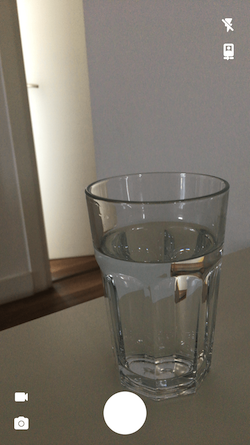

# AVFoundation Custom Camera App

## Usage
Steps
1. Clone app
2. Open terminal and go to project file
3. Print 'pod install' and press return/enter
4. Open .xcworkspace extension file with xcode
5. Run project(You need a physical iOS device!)

## Preview

## Resource
<a href="https://www.appcoda.com/avfoundation-swift-guide/" target="_blank">Appcoda Building a Full Screen Camera App Using AVFoundation Tutorial</a>
